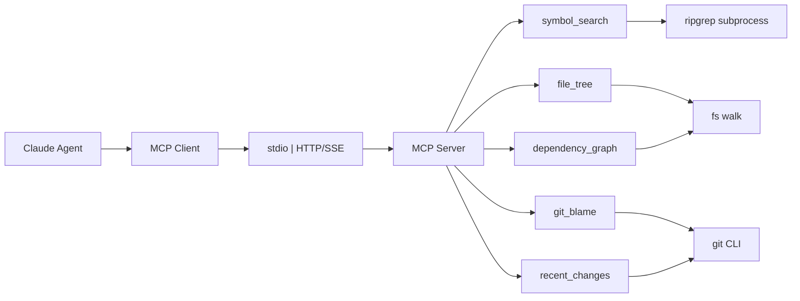
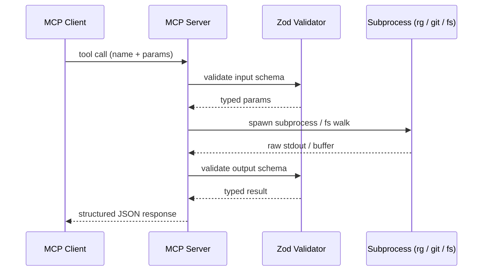

# MCP Codebase Context Server

  

> Give Claude agents full, structured access to any local codebase — without pasting files.

MCP server (stdio + HTTP/SSE) that exposes a local codebase as structured tools for Claude agents: symbol search via ripgrep, gitignore-aware file tree, git blame and recent-change parsing, dependency graph from package manifests. All tool outputs are Zod-validated JSON. On startup, the server validates that ripgrep is available in PATH and exits with code 1 if missing.

## Table of contents

- [About](#about)
- [Tech](#tech)
- [Architecture](#architecture)
- [Installation](#installation)
- [Usage](#usage)
- [Contributing](#contributing)
- [License](#license)

## About

MCP server (stdio + HTTP/SSE) that exposes a local codebase as structured tools for Claude agents: symbol search via ripgrep, gitignore-aware file tree, git blame and recent-change parsing, dependency graph from package manifests. All tool outputs are Zod-validated JSON. On startup, the server validates that ripgrep is available in PATH and exits with code 1 if missing.

**What this demonstrates**

- MCP protocol implementation across stdio and HTTP/SSE transports
- Zod schema validation enforcing typed tool output contracts
- Streaming large file content with backpressure control
- Git history traversal: log, blame, and unified diff parsing
- Gitignore-aware recursive file filtering without shell globbing
- Integration testing of concurrent HTTP sessions to assert per-session state isolation
- CI pipeline configuration with strict TypeScript checking, ESLint enforcement, and per-directory coverage thresholds

## Tech

TypeScript · Node.js · MCP SDK · Zod · ripgrep

## Architecture

### Request flow

Every tool call travels from the Claude agent through an MCP client and the chosen transport into the server, which routes to one of five tool handlers. Each handler delegates to a backend process — ripgrep subprocess, native `fs` walk, or git CLI — and the raw output is Zod-validated before being returned as structured JSON to the agent.



### Tool call round-trip

A single tool call passes through two Zod checkpoints — input params are validated before any subprocess is spawned, and raw subprocess output is validated before it leaves the server. Both the agent's requests and the process output are type-safe at every boundary; malformed subprocess output produces a typed error object rather than an unhandled exception.



### Choosing a transport

Use **stdio** when running the server as a local subprocess — it is the correct choice for Claude Desktop (`claude_desktop_config.json`) and any CLI agent on the same machine, because the parent process owns the server's lifetime and communication happens over standard streams with zero network overhead. Use **HTTP/SSE** when the server must be reachable from a remote agent, a container, or multiple clients simultaneously; the SSE channel allows the server to stream partial results back without holding a long-polling connection, and each HTTP session keeps its own root-directory scope so concurrent requests cannot contaminate each other's file-tree or symbol-search results.

## Installation

```bash
git clone https://github.com/Hauckjf/mcp-codebase-context.git
cd mcp-codebase-context
# install dependencies
```

## Usage

_Examples coming with the first feature release._

## Definition of done

- Claude Desktop connects via stdio config and answers 'where is X defined?' using only the server's tools — no file pasting
- HTTP/SSE transport handles concurrent requests without shared state leaks: an integration test spawns the server, fires 10 concurrent requests split across two sessions with distinct root directories, and asserts that each session's file-tree and symbol-search results are scoped to its own root with zero cross-contamination
- All tool responses conform to Zod schema — malformed subprocess output (e.g., truncated ripgrep JSON) returns a typed error object with 'code' and 'message' fields, not an unhandled exception or a 500 response
- If ripgrep is not found in PATH at startup, the server prints 'Error: ripgrep (rg) is required but was not found in PATH. Install it from https://github.com/BurntSushi/ripgrep#installation' and exits with code 1 before accepting any connections
- CI workflow (GitHub Actions) passes tsc --noEmit, ESLint with @typescript-eslint/strict ruleset zero warnings, and vitest with an 80% statement coverage threshold scoped to src/tools/** — any commit dropping below threshold fails the check and blocks merge
- README covers five named sections: Prerequisites (ripgrep minimum version + OS install commands), Installation (npx one-liner + a ready-to-paste claude_desktop_config.json block), Available Tools (one table per tool listing input schema fields, output schema fields, and a short example call), Transport Config (stdio vs HTTP/SSE setup shown side-by-side with annotated config snippets), Contributing (clone + install steps, how to run unit and integration tests separately, and a walkthrough for adding a new tool with its Zod schema)

## Contributing

See [.github/CONTRIBUTING.md](.github/CONTRIBUTING.md).

## License

[MIT](LICENSE)
